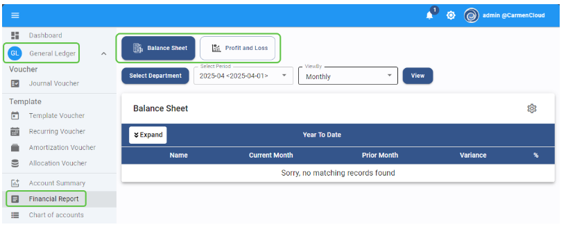
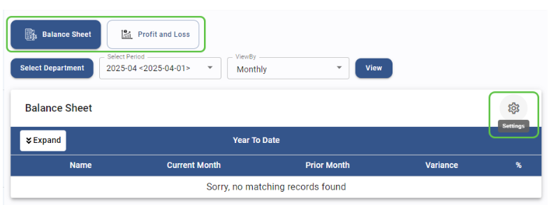
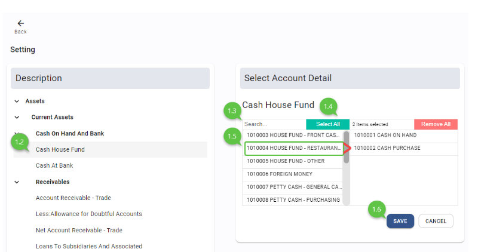
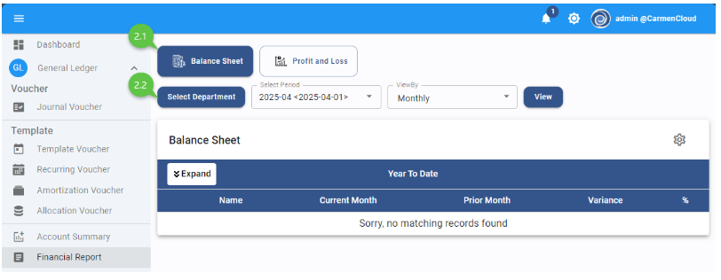
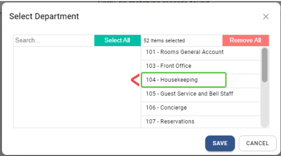
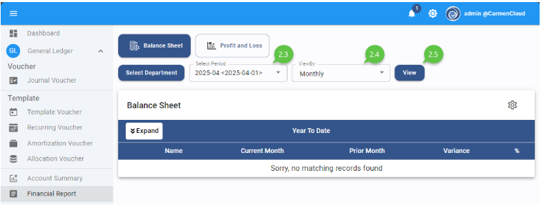
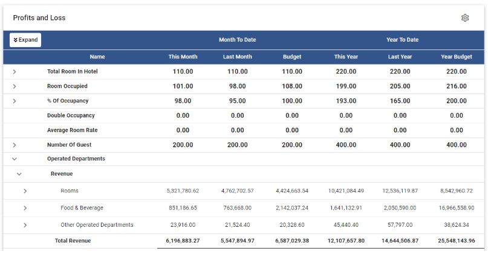
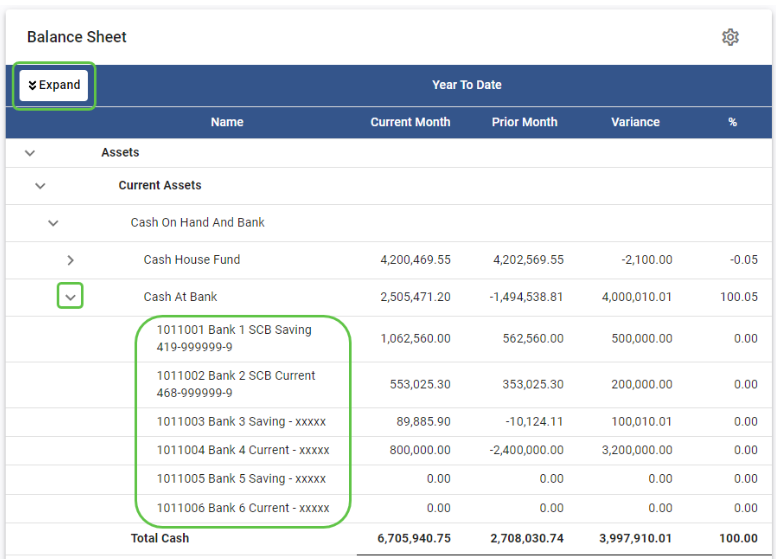
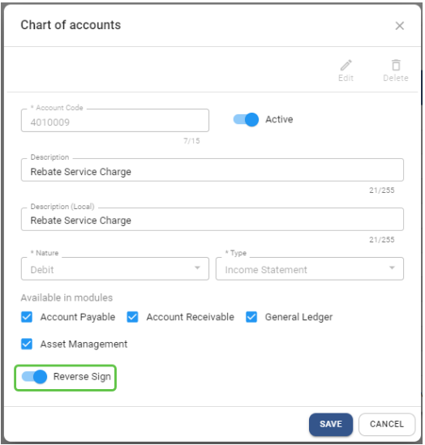
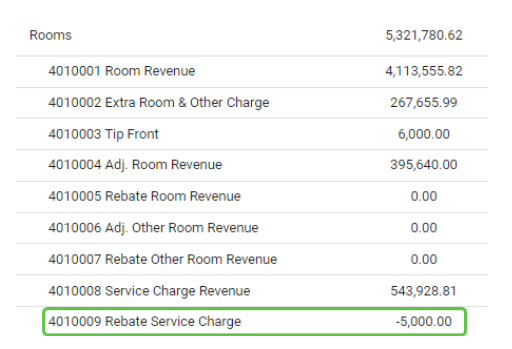

# Financial Report

## Financial Report (รายงานทางการเงิน)

Financial Report (รายงานทางการเงิน)

Financial ใช้สำหรับการเรียกดูงบการเงินตามมาตรฐานของระบบ สำหรับงบการเงินที่ซับซ้อนนั้นลูกค้าสามารถใช้ Excel Add In ในการเรียกดูได้ตามปกติ

Financial Report ในระบบ Carmen แบ่งเป็น 2 รายงาน

A.Profit and Loss (งบกำไร(ขาดทุน))

B.Balance Sheet (งบดุล หรือ งบแสดงฐานะทางการเงิน)

สามารถเข้าใช้งานจาก module “General Ledger” 

ไปที่หัวข้อ “Financial Report”

1.ขั้นตอนการตั้งค่า Mapping Account Code ให้รายงาน Profit and Loss และ Balance Sheet ก่อนเริ่มดูรายงาน

1.1เลือกรายงานที่ต้องการ และ Click ปุ่ม “Setting” รูปฟันเฟือง

1.2 ที่ “Description” .ให้ Click หัวข้อที่ต้องการ Mapping ผังบัญชี เช่น “Cash House Fund” แล้วระบบจะแสดงหน้าต่าง “Select Account Detail” ให้ทำการ mapping

ขั้นตอนการ mapping Account codeในหน้าต่าง “Select Account Detail”

1.3 “Search Box” สามารถค้นหาชื่อหรือรหัสของ Account code ที่ต้องการ mapping

1.4 “Select All” สามารถเลือก account code ทั้งหมดที่ต้องการ

1.5 Click เลือก Account code ที่ต้องการ mapping แล้ว ระบบจะย้าย Account code นั้นไปทางขวามือ และสามารถเลือกได้มากกว่า 1 account code ระบบจะทำการ “Summary” จาก account code ที่ Mapping เอาไว้สำหรับ “Cash House Fund”

1.6 Click “Save” เพื่อบันทึกการ mapping หรือ “Cancel” เพื่อยกเลิกการ mapping

ขั้นตอนการยกเลิก mapping Account codeในหน้าต่าง “Select Account Detail”

1.7 “Remove All” สามารถเลือก account code ทั้งหมดที่ต้องการยกเลิก

1.8 Click เลือก Account code ที่ต้องการยกเลิก mapping แล้ว ระบบจะย้าย Account code นั้นกลับไปซ้ายมือ 

1.9 Click “Save” เพื่อบันทึก หรือ “Cancel” เพื่อยกเลิก

Video ประกอบ

<h3 style="margin: 0;">การ mapping ผังบัญชีกับงบการเงิน</h3>
<iframe width="560" height="315" src="https://www.youtube.com/embed/EEXq1d23n58?si=NA5q0VOZWKMkyKI_" title="YouTube video player" frameborder="0" allow="accelerometer; autoplay; clipboard-write; encrypted-media; gyroscope; picture-in-picture; web-share" referrerpolicy="strict-origin-when-cross-origin" allowfullscreen></iframe>

<iframe width="560" height="315" src="https://www.youtube.com/embed/UVNkjjrdhdw?si=lkYDU2zVnnj0zIZc" title="YouTube video player" frameborder="0" allow="accelerometer; autoplay; clipboard-write; encrypted-media; gyroscope; picture-in-picture; web-share" referrerpolicy="strict-origin-when-cross-origin" allowfullscreen></iframe>

2. ขั้นตอนการดูรายงาน “Balance Sheet”

2.1 เลือกรายงาน “Balance Sheet”

2.2 Click ที่ปุ่ม “Select Department” เพื่อเลือก department ที่ต้องการ filter 

- ระบบจะแสดงหน้าต่างให้เลือก “Department” โดยระบบจะเลือกแผนกทั้งหมดเป็นค่าตั้งต้น

- Click ที่รหัส “Department” ที่ไม่ต้องการแสดงในรายงาน แล้วระบบจะย้ายกลับไปทางซ้าย

- Click “Save” เพื่อบันทึก หรือ “Cancel” เพื่อยกเลิก

2.3 “Select Period” กำหนดรอบบัญชีที่ต้องการดูรายงาน

2.4 “View By” กำหนดมุมมองของรายงานที่ต้องการ แบ่งได้เป็น 2 รูปแบบ

- “Monthly” แสดงตัวเลขการเปรียบเทียบ ระหว่างยอดสะสมจนถึงเดือนที่เรียกรายงาน และยอดสะสมก่อนเดือนที่เรียกรายงาน
ความหมายของ column ในรายงานแบบ “Monthly” มีดังนี้

   - Current Month = ยอดรวมตั้งแต่ใช้ระบบ จนถึง Period ที่เลือกจาก “Select Period”
   - Prior Month = ยอดรวมตั้งแต่ใช้ระบบ จนถึง Period ที่แล้ว ที่เลือกจาก “Select Period”|
   - Variance = ผลต่างของ Current Month ลบด้วย Prior Month
   - % = คำนวนจาก Variance 

- “Annual” แสดงตัวเลขการเปรียบเทียบ ระหว่างยอดสะสมจนถึงเดือนที่เรียกรายงาน และยอดสะสม ณ สิ้นปีก่อนปีที่เรียกรายงาน
ความหมายของ column ในรายงานแบบ “Annual” มีดังนี้
   - Current Year = ยอดรวมตั้งแต่ใช้ระบบ จนถึง Period ที่เลือกจาก “Select Period”
   - Prior Year = ยอดรวมตั้งแต่ใช้ระบบ จนถึง ปี ที่แล้ว ที่เลือกจาก “Select Period”
   - Variance = ผลต่างของ Current Year ลบด้วย Prior Year
   - % = คำนวนจากช่อง Variance

2.5 Click ที่ “View” เพื่อดูรายงาน

2.6 ระบบจะแสดงรายงานตามรูปแบบมาตรฐานของระบบ และแสดงจำนวนเงินตามการ mapping “Account Code” ที่กำหนดไว้ 

Video ประกอบ

<h3 style="margin: 0;">การดูงบดุล</h3>
<iframe width="560" height="315" src="https://www.youtube.com/embed/PksI0Rg6sog?si=H0Gta55XGON4QtF1" title="YouTube video player" frameborder="0" allow="accelerometer; autoplay; clipboard-write; encrypted-media; gyroscope; picture-in-picture; web-share" referrerpolicy="strict-origin-when-cross-origin" allowfullscreen></iframe>

<iframe width="560" height="315" src="https://www.youtube.com/embed/_Id6jYLIXmg?si=Mrwaw00VAvaf-or8" title="YouTube video player" frameborder="0" allow="accelerometer; autoplay; clipboard-write; encrypted-media; gyroscope; picture-in-picture; web-share" referrerpolicy="strict-origin-when-cross-origin" allowfullscreen></iframe>

3. ขั้นตอนการดูรายงาน “Profit and Loss”

3.1 เลือกรายงาน “Profit and Loss”

3.2 Click ที่ปุ่ม “Select Department” เพื่อเลือก department ที่ต้องการ filter 

   - ระบบจะแสดงหน้าต่างให้เลือก “Department” โดยระบบจะเลือกแผนกทั้งหมดเป็นค่าตั้งต้น
   - Click ที่รหัส “Department” ที่ไม่ต้องการแสดงในรายงาน แล้วระบบจะย้ายกลับไปทางซ้าย
   - Click “Save” เพื่อบันทึก หรือ “Cancel” เพื่อยกเลิก

3.3 “Select Period” กำหนดรอบบัญชีที่ต้องการดูรายงาน

3.4 “Select Budget (Revision)” Click เลือก “Budget” ที่ต้องการให้แสดงเปรียบเทียบ
  - Annual คือ Budget version หลัก
  - Revision 1 – 4 คือ budget revision

  ความหมายของ column ในรายงาน “Profit and Loss” มีดังนี้

3.4.1 MONTH TO DATE 
  - This Month = ยอดของ Period ที่เลือกจาก “Select Period”
  - Last Month = ยอดของ Period ที่ผ่านมาจาก “Select Period”
  - Budget = ยอดของ Budget ที่เลือกจาก “Select Budget (Revision)” ของ Period ที่เลือก จาก “Select Period”

3.4.2 YEAR TO DATE 
  - This Year = ยอดรวมจาก Period เริ่มต้น จนถึง Period ที่เลือก ณ ปีที่เลือก จาก “Select Period”
  - Last Year = ยอดรวมจาก Period เริ่มต้น จนถึง Period ที่เลือก ของปีที่ผ่านมา จาก “Select Period”
  - Year Budget = ยอดรวมของ Budget ที่เลือกจาก “Select Budget (Revision)” จาก Period เริ่มต้น จนถึง Period ที่เลือก ณ ปีที่เลือก จาก “Select Period”

3.5 Click ที่ “View” เพื่อดูรายงาน

3.6 ระบบจะแสดงรายงานตามรูปแบบมาตรฐานของระบบ และแสดงจำนวนเงินตามการ mapping “Account Code” ที่กำหนดไว้
  

 
Video ประกอบ

<h3 style="margin: 0;">การดูงบกำไรขาดทุน</h3>
<iframe width="560" height="315" src="https://www.youtube.com/embed/BczkO99PT7E?si=FJncfLlSQiEfco2N" title="YouTube video player" frameborder="0" allow="accelerometer; autoplay; clipboard-write; encrypted-media; gyroscope; picture-in-picture; web-share" referrerpolicy="strict-origin-when-cross-origin" allowfullscreen></iframe> 

<iframe width="560" height="315" src="https://www.youtube.com/embed/1DGcJbGJH6g?si=APeru4hmt3MIhh9q" title="YouTube video player" frameborder="0" allow="accelerometer; autoplay; clipboard-write; encrypted-media; gyroscope; picture-in-picture; web-share" referrerpolicy="strict-origin-when-cross-origin" allowfullscreen></iframe>   
    
4.Function อื่น ๆ เพิ่มเติมดังนี้
  - Click ที่ “Expand” เพื่อแสดงรายละเอียดจำนวนเงินแยกตาม Account Code ที่ map เอาไว้ของทุกบรรทัด หรือ “Collapse” เพื่อย่อรายงานกลับมาเป็นแบบ Summary
  - Click ที่เครื่องหมาย “>” เพื่อแสดงรายละเอียดจำนวนเงินแยกตาม Account Code ที่ map เอาไว้ของบรรทัดที่เลือก

5. การตั้งค่า Reverse Sign

5.1 ใน Chart Of Accounts มีการเพิ่มการตั้งค่า “Reverse Sign” 

5.2 การตั้งค่านี้จะมีผลกับ Financial Report ในระบบเท่านั้น

5.3 Function นี้ใช้ในกรณีที่ต้องการกลับตัวเลขให้แสดงผลตรงกันข้าม 

5.3.1 เช่น account code ที่เป็นตัวลดรายได้ จากตัวอย่างคือ “Rebate Service Charge” จะเห็นว่า Account code นี้มี nature เป็น Debit ดังนั้นระบบจะทำการคำนวณตาม nature และแสดงผลเป็นยอดบวก

5.3.2 เมื่อตั้งค่า reverse sign แล้ว ระบบจะทำการแสดงผลตรงกันข้าม ดังนั้น “Rebate Service Charge” จะแสดงผลเป็นติดลบ เพื่อทำให้รายได้ในหมวด “Room” มีมูลค่าลดลง

