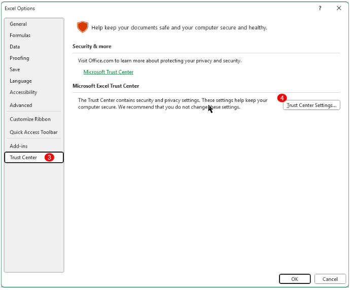
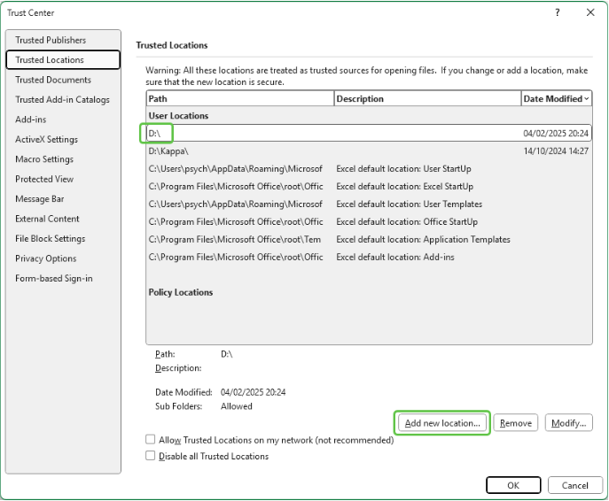
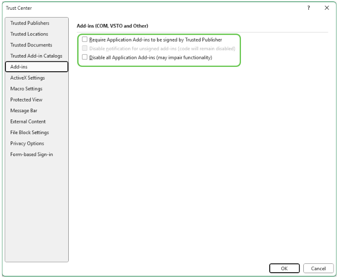

# Excel Security setting for Carmen Add-in
การตั้งค่าเพิ่มเติมบน Excel เกี่ยวกับ Security เพื่อให้ Carmen Add-In สามารถใช้งานได้สมบูรณ์

    

1.ไปที่ File แล้ว Excel จะแสดงแถบด้านข้าง

2.เลือก Options 

3.เลือก Trust Center

4.เลือก Trust Center Settings

    

5.ดำเนินการตั้งค่าใน Trus Center ตามหัวข้อดังต่อไปนี้

5.1.Trusted Location ใช้ในการกำหนดสถานที่ที่จะเก็บ file Workbook หรืองบการเงิน เพื่อให้ excel ไม่ block macro Carmen Add In หากเก็บ file เอาไว้ที่ location ที่ได้ตั้งค่า อาจจะทำให้ Macro ทำงานได้ไม่สมบูรณ์

5.1.1.กดปุ่ม Add new locations เพื่อระบุสถานที่ หรือ folder บน Computuer

5.1.2.จากตัวอย่างจะ save file เอาไว้ที่ drive D

    

5.2.Add-Ins ตรวจสอบว่าได้เอา check box ออกทั้งหมด

    

5.3.Macro Settings ทำการตั้งค่าให้เหมือนกับรูปตัวอย่าง

    

5.4.Protected View ให้เอา check box ออกให้หมด

    

5.5.File Block Settings 

5.5.1.File Type ให้เอา check box ออกให้หมดทุกรายการ

5.5.2.ให้เลือกเป็น Open Selected File types in Protected View and allow editing

    

5.6.กด OK เพื่อเสร็จสิ้นการตั้งค่า Trust Center

6.กด OK อีกครั้งเพื่อเสร็จสิ้นการตั้งค่า Excel Options

